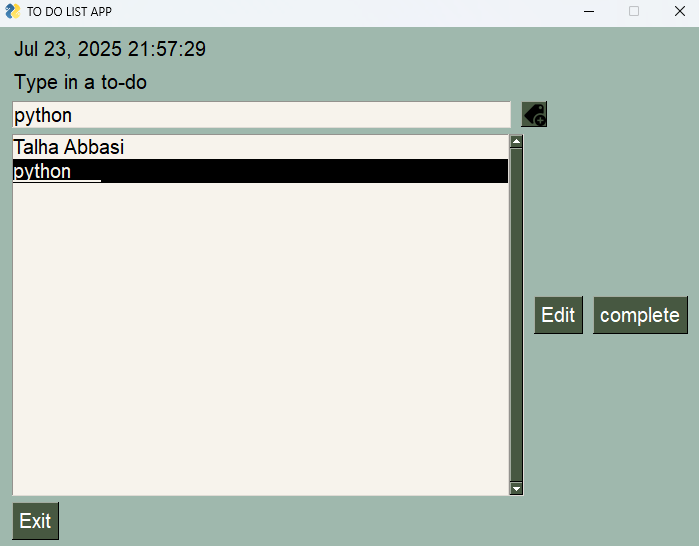

# ✅ To-Do List App python App

This is a simple **To-Do List App** built using Python and the `FreeSimpleGUI` (PySimpleGUI) library. The app allows users to:

- Add new to-do items
- Edit existing tasks
- Mark tasks as complete
- View current date and time (real-time clock)
- Exit the app safely

---

## 🖥️ App Interface

Here’s how the app looks:

### 🧾 Add and Edit Tasks


---

## 📂 Features

- Simple GUI built using `FreeSimpleGUI`
- Real-time clock displayed in the app
- Automatic file creation (`todos.txt`) if not found
- Edit tasks directly from the list
- Mark and remove completed tasks
- Easy-to-use layout and clean code

---

## 🚀 Getting Started

### ✅ Prerequisites

Make sure you have Python installed. You also need the following libraries:

```bash
pip install PySimpleGUI
